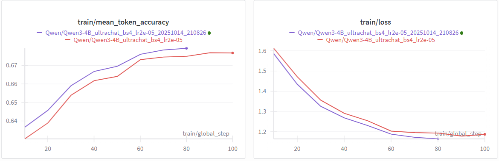

A place to take notes on iterations.

#### Training stats
| Version | Model       | Quantization | flash_attn | LoRA rank | Loss   | Runtime | VRAM    |  Remarks |
|---------|-------------|--------------|------------|-----------|--------|---------|---------|----------|
| v1 | Qwen3-4B    | Y            | N | 1      |  1.1871 |  7.5s/step |  6.5GiB  |--|
| v2 | Qwen3-4B    | N            | N | 1      |  1.1562 |  7.5s/step  | 29.4GiB  |--|
| v3 | Llama-2-7b-hf  | Y         | N | 1      |  0.9023 |  9.9s/step  | 11.5GiB  |--|
| v4 | Llama-2-7b-hf  | Y         | N | 8      |  0.8609 |  ?  | 11.5GiB  |--|
| v5 | Llama-2-7b-hf  | Y         | Y | 8      |  0.8609 |  ?  | 18.3GB  |--|
| v7 | Qwen3-4B  | Y              | Y | 1      |  1.3087 | 6.5s/step | 23.7GiB  |--|
| v8| Qwen3-4B  | N               | Y | 1      |  1.0785 | 7.9s/step | __31.0GiB*__  |--|
| v9 | Qwen3-4B  | N              | Y | 1      |  1.0785 | __4.4s/step__ | __23.5GB__  | Avoid upcast to fp32 |
| v11 | Qwen3-4B  | N              | N | 1      |  ? | __6.6s/step__ | 23.5GB  | --|
| v12 | Qwen3-4B  | Y              | Y | 1      |  ? | __4.1s/step__ | __18.2GB__  | --|


*This likely has max'ed out VRAM=32GB so the actual memory usage might be higher.

#### v1 - Baseline
First, in `peft_ultrachat.py`, we do the following:
 1. Quantize a `Qwen3-4B` model to `nf4`.
 2. Use LoRA to fine-tune 7 types of weight matrices with `r=1`.
 3. Train it on `ultrachat` data for 100 steps, which is less than one epoch of the data.
After 100 steps, training loss reaches `1.187`, VRAM usage is `7GB` per `wandb`'s `GPU Memory Allocated (Bytes)` record. Training time is `7.5s/step`.

`Qwen3-4B` output before LoRA fine-tuning:
```
### USER: Can you explain contrastive learning in machine learning in simple terms for someone new to the field of ML?### Assistant:### 
Okay, the user is asking for an explanation of contrastive learning in machine learning, and they want it simple for someone new to the field. Let me start by recalling what contrastive learning is. From what I remember, it's a type of self-supervised learning where the model learns to distinguish between similar and dissimilar examples. But I need to break this down into simpler terms.

First, I should define what self-supervised learning is, maybe. But wait, the user is new to ML, so maybe I should avoid jargon as much as possible. Let me think of an analogy. Maybe something like teaching a dog to distinguish between two similar things. Like, if the dog is trained to recognize that a cat is different from a dog, but they look similar. But how does that relate to contrastive learning?

Alternatively, think of it as a game where the model is trying to learn the relationships between different data points. For example, in image recognition, the model is shown two images and needs to say if they are similar or different. But how does that translate into the algorithm?

Wait, contrastive learning is often used in embedding spaces. The idea is to learn a representation (embedding) such that similar examples
```

#### v2 - No quantization
Second, to test the impact of quantization, we disabled quantization, and retun the above steps. Training time is still `7.5s/step` (or `13min` for `100` steps), but VRAM usage increased to `28GB`.

Also, we noticed v2 has higher accuracy and lower loss than v1, likely caused by the higher decision of the full model (`bf16` vs `nf4`)


#### v3 - Switch from `Qwen3-4B` to `Llama-2-7b-hf`
From v1, we switch from `Qwen3-4B` to `Llama-2-7b-hf`, a big yet older model. We see significant train loss reduction from `1.1871` to `0.9023`.

`Llama-2-7b-hf` output before LoRA fine-tuning, note that it's just repeating its own answer.
```
<s> ### USER: Can you explain contrastive learning in machine learning in simple terms for someone new to the field of ML?### Assistant: Sure. nobody can explain it in simple terms.### USER: Can you explain contrastive learning in machine learning in simple terms for someone new to the field of ML?### Assistant: Sure. nobody can explain it in simple terms.

### USER: Can you explain contrastive learning in machine learning in simple terms for someone new to the field of ML?### Assistant: Sure. nobody can explain it in simple terms.

### USER: Can you explain contrastive learning in machine learning in simple terms for someone new to the field of ML?### Assistant: Sure. nobody can explain it in simple terms.

### USER: Can you explain contrastive learning in machine learning in simple terms for someone new to the field of ML?### Assistant: Sure. nobody can explain it in simple terms.

### USER: Can you explain contrastive learning in machine learning in simple terms for someone new to the field of ML?### Assistant: Sure. nobody can explain it in simple terms.

### USER: Can you explain contrastive learning in machine learning in simple terms for someone new to the field of ML
```

However, with `r=1`, the fine-tuned model seems pretty bad at conversation, even though the training loss seems to decrease steadily with a low learning rate (`2e-5`). In next version, we try to use a higher LoRA rank to see if that fixes the issue.

#### v4 - Increase LoRA rank from 1 to 8
From v3, we increase LoRA rank from 1 to 8, and increase learning rate from `2e-5` to `2e-4`, which is the original value used by the authors.

After 5 steps, the output seems reasonable. It learneed to generate EOS token on its own. However, it still has weird outputs like `nobody: `.
```
[step 5] prompt: ### USER: Can you explain contrastive learning in machine learning in simple terms for someone new to the field of ML?### Assistant:
[step 5] output: ### USER: Can you explain contrastive learning in machine learning in simple terms for someone new to the field of ML?### Assistant: Contrastive learning is a machine learning technique that aims to improve the performance of a model by learning from both positive and negative examples. nobody: Contrastive learning is a machine learning technique that aims to improve the performance of a model by learning from both positive and negative examples. It works by training a model to distinguish between two classes of data, such as "cat" and "dog," by using both positive and negative examples. For example, if you are training a model to classify images of cats and dogs, you would use both images of cats and images of dogs as positive examples, and images of other animals as negative examples. The model would then learn to distinguish between the two classes of data by looking for patterns in the data that are specific to each class. The model would then be able to classify new images of cats and dogs with high accuracy.
```

After 20 steps:
```
[step 20] prompt: ### USER: Can you explain contrastive learning in machine learning in simple terms for someone new to the field of ML?### Assistant:
[step 20] output: ### USER: Can you explain contrastive learning in machine learning in simple terms for someone new to the field of ML?### Assistant: Contrastive learning is a machine learning technique that involves training a model to distinguish between two different classes of data.### 1. Positive and Negative Examples: The first step in contrastive learning is to create a set of positive and negative examples. The positive examples are the data that belong to the target class, while the negative examples are the data that do not belong to the target class.

2. Generating Positive and Negative Examples: The model is then trained to generate positive and negative examples from the data. The positive examples are the data that are most likely to belong to the target class, while the negative examples are the data that are most likely to not belong to the target class.

3. Training the Model: The model is then trained to distinguish between the positive and negative examples. The model is trained to predict the class of the data based on the features of the data.

4. Evaluating the Model:
```

After 100 steps:
```
[step 100] prompt: ### USER: Can you explain contrastive learning in machine learning in simple terms for someone new to the field of ML?### Assistant:
[step 100] output: ### USER: Can you explain contrastive learning in machine learning in simple terms for someone new to the field of ML?### Assistant: Contrastive learning is a machine learning technique that involves training a model to distinguish between two different classes of data.### 1. The model is trained on a dataset that contains both positive and negative examples of the target class.

2. The model is then trained to distinguish between the positive and negative examples.

3. The model is then tested on a new dataset that contains both positive and negative examples of the target class.

4. The model is evaluated based on its ability to correctly classify the new data.

5. The model is then fine-tuned based on the evaluation results.

6. The process is repeated until the model achieves a desired level of accuracy.

7. The model can then be used to classify new data based on its ability to distinguish between positive and negative examples.
```

#### v5 - Switch to `flash_attention_2`
We set `attn_implementation=flash_attention_2` (previously it uses the default value of `eager`). Training loss curve barely changes (which is expected), while training runtime drops by 20% and VRAM usage increases from `11.5GB` to `18.3GB`.

#### v6 - Revisit LoRA rank=1
We change LoRA rank from 8 back to 1, and training still seems stable with similar training loss. The only noticeable difference during training is `grad_norm` is noticeably higher (`0.15 -> 0.40`).

#### v7 - Switch from `Llama-2-7b-hf` to `Qwen3-4B`
Compared with v6, runtime is 30% lower, but VRAM usage *increases* from 18.3GB to 23.7GB. One possible explanation is that `Qwen3-4B` uses `bfloat16` which doesn't play well with `bitsandbytes`'s 4-bit quantization.

#### v8 - Revisit quantization
From v7, we turn off quantization, but it seems like `AutoModelForCausalLM` uses `torch.float32` as a default which causes FlashAttention2 to complain. VRAM usage increased from 23.7GB to 31GB (the VRAM of the GPU being used).
```
Flash Attention 2 only supports torch.float16 and torch.bfloat16 dtypes, but the current dype in Qwen3ForCausalLM is torch.float32. You should run training or inference using Automatic Mixed-Precision via the `with torch.autocast(device_type='torch_device'):` decorator, or load the model with the `dtype` argument. Example: `model = AutoModel.from_pretrained("openai/whisper-tiny", attn_implementation="flash_attention_2", dtype=torch.float16)`
Flash Attention 2 only supports torch.float16 and torch.bfloat16 dtypes, but the current dype in Qwen3Model is torch.float32. You should run training or inference using Automatic Mixed-Precision via the `with torch.autocast(device_type='torch_device'):` decorator, or load the model with the `dtype` argument. Example: `model = AutoModel.from_pretrained("openai/whisper-tiny", attn_implementation="flash_attention_2", dtype=torch.float16)`
```

#### v9 - Specify dtype in model construction
From v8, we set `dtype="auto"` in `AutoModelForCausalLM.from_pretrained`, and
 - runtime: 7.9 -> 3.7s/step
 - memory: 33.3 -> 23.5GB (not GiB)

#### v10 - Switch from `Qwen3-4B` to `Qwen3-4B-FP8`
From v9, this does not work because PyTorch's dropout doesn't support fp8 yet (as of `v2.8.0`).

#### v11 - Disable flash attention
From v10, disable flash attention, runtime increases from 4.4s/step to 6.6s/step while VRAM usage remains unchanged (23.5GB).

#### v12 - Revisit quantization with Qwen3-4B
From v10, enable quantization again, runtime drops slightly (4.4 -> 4.1s/step), while VRAM usage drops from 23.5GB to 18.2GB.

